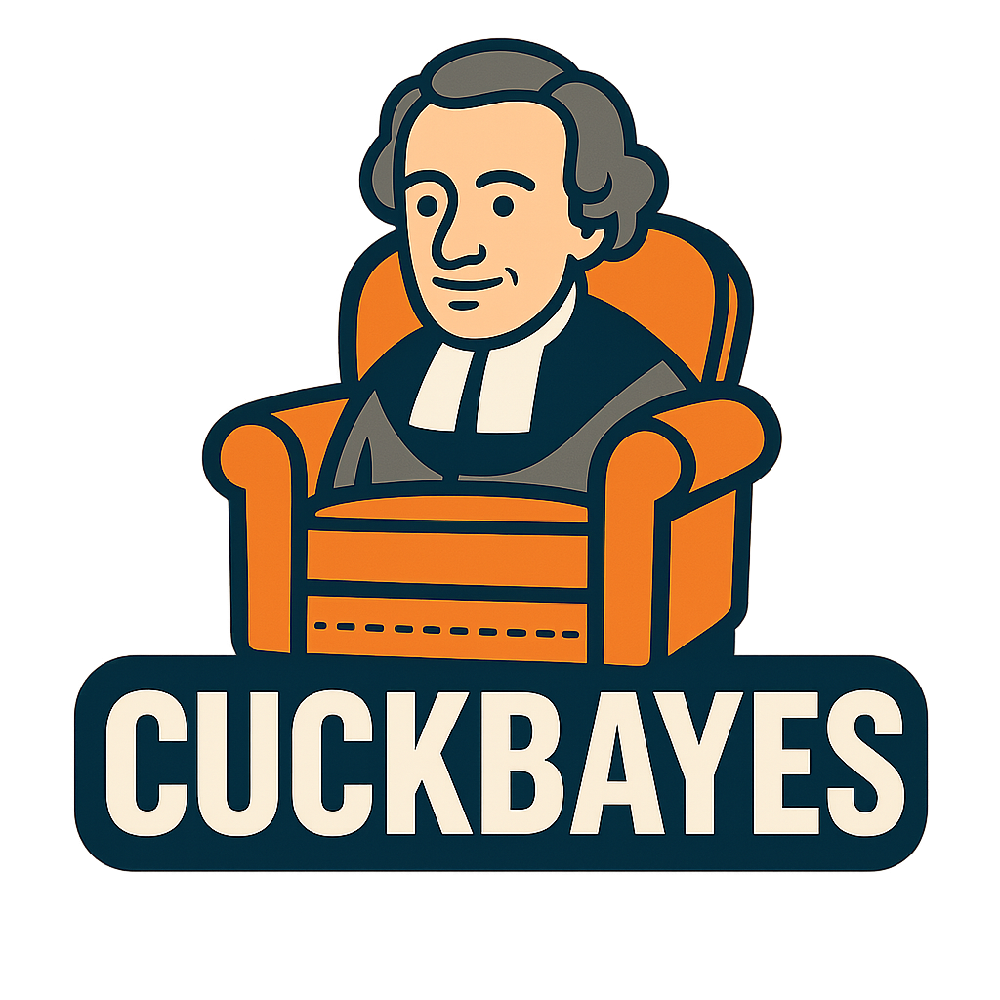

# 🧠 CuckBayes™

> The world's first Bayesian-powered archetype classifier.  
> Now featuring Signal integration, prank payloads, interactive AI narration, and certification from prestigious fictional universities in cybersecurity.



[](LICENSE)


---

## 🤖 What is CuckBayes?
**CuckBayes™** is a parody command-line application that classifies users into archetypes based on lifestyle, technology habits, and OT/IT cybersecurity affinities. Your answers are fed into a Bayesian scoring engine that produces a final classification:

- 🔒 **Cuckman** — Signal-using, chair-watching, ICS-overwhelmed softshells  
- 💪 **Alphaman** — Grid-hardening, OT-pentesting, protein-shaking dominators

### Now Featuring:
- **🗣️ CuckGPT** — A sarcastic CLI narrator powered by a local Ollama LLM
- **🎶 Theme Music** — Terminal-width intro banner and optional music
- **💣 Prank Payloads** — For both Cuckman and Alphaman types
- **📡 Signal Integration** — For broadcasting results to your group
- **📜 Certification** — Auto-generated PNG certs with fictional degrees

---

## 🧰 Features
- ✅ Interactive CLI quiz (with `rich` and `InquirerPy`)
- 🤖 Real-time AI commentary via `Ollama` and local models like `llama3`
- 🎓 Auto-generated certification PNGs with your name
- 📡 Optional Signal CLI messaging to preconfigured group
- 💣 Prank payloads for **both** Cuckman and Alphaman results
- 🧠 Bayesian logic-based scoring system
- 🖼️ Mascots, icons, and certificate templates included
- 📂 Cross-platform file opening of generated certs
- 🪖 Malware-themed jokes recognizable to OT/IT cybersecurity pros
- 🎵 Intro theme music powered by `pygame` (optional)

---

## ⚙️ Installation

### 🔑 Prerequisites
- **Python 3.10+**
- **Ollama** installed with the [`llama3`](https://ollama.com/library/llama3) model
- **Optional:** `signal-cli` for Signal message sending
- **Optional:** `pygame` for sound playback

---

### 💻 Quick Setup: Windows

After cloning the repo:

```bash
git clone https://github.com/dark-carbon-code/CuckBayes.git
cd CuckBayes
setup_win.bat
````

The `setup_win.bat` script:

* Sets up a virtual environment
* Installs dependencies
* Pulls the `llama3` model via `ollama`
* Launches the CLI

---

### 🍎 Quick Setup: macOS/Linux

After cloning the repo:

```bash
git clone https://github.com/dark-carbon-code/CuckBayes.git
cd CuckBayes
chmod +x setup_mac.sh
./setup_mac.sh
```

This will:

* Create a virtual environment
* Install all dependencies
* Pull the `llama3` model via `ollama`
* Launch the app

---

### 🧪 Manual Setup (All Platforms)

#### 1. Create & activate virtual environment

**Windows:**

```bash
python -m venv venv
venv\Scripts\activate
```

**macOS/Linux:**

```bash
python3 -m venv venv
source venv/bin/activate
```

#### 2. Install dependencies

```bash
pip install --upgrade pip
pip install -r requirements.txt
```

#### 3. Install Ollama and pull a model

Install from [https://ollama.com/download](https://ollama.com/download)

Then run:

```bash
ollama pull llama3
```

---

## 🧠 How to Use

From the project root:

```bash
python cuckbayes_cli.py
```

You’ll be prompted to:

1. Enter your name
2. Answer lifestyle + cybersecurity archetype questions
3. Watch the Matrix-style intro + music (if enabled)
4. Hear **CuckGPT** react in real-time (via Ollama)
5. Receive your final verdict (Cuckman or Alphaman)
6. Trigger appropriate prank payloads
7. (If Cuckman) Receive printable PNG certifications

---

## 📡 Signal Integration (Optional)

To enable Signal broadcasting:

1. Install [`signal-cli`](https://github.com/AsamK/signal-cli)
2. Register your phone via QR code
3. Update `utils/messaging.py` with:

   * Your phone number
   * Group ID

---

## 🐳 Docker Support (Coming Soon)

A `Dockerfile` will allow isolated, sandboxed use of CuckBayes™ with the local model, prank triggers, and sound.

---

## 📁 Project Structure

```
CuckBayes/
├── assets/                  # Mascots, icons, audio, cert templates
├── cli/                     # CLI quiz, banner, and output logic
├── model/                   # Bayesian predictor
├── scripts/                 # Signal + prank payloads
├── utils/                   # Cert generator and CuckGPT integration
├── generated_certs/        # PNG output folder
├── setup_mac.sh            # macOS setup
├── setup_win.bat           # Windows setup
├── requirements.txt
├── cuckbayes_cli.py        # Main entry point
└── README.md
```

---

## 📜 License

MIT License. For parody/satire only.
Not affiliated with any actual universities, agencies, or certification bodies.

---

## 🙌 Credits

Built by cyber nerds for cyber nerds.
Inspired by:

* ICS malware memes
* MITRE ATT\&CK archetypes
* Signal chat absurdity
* Bad Bayesian logic
* Good AI parodies

> *"Cuculus Semper Vigilantes" — Signal State University Motto*
